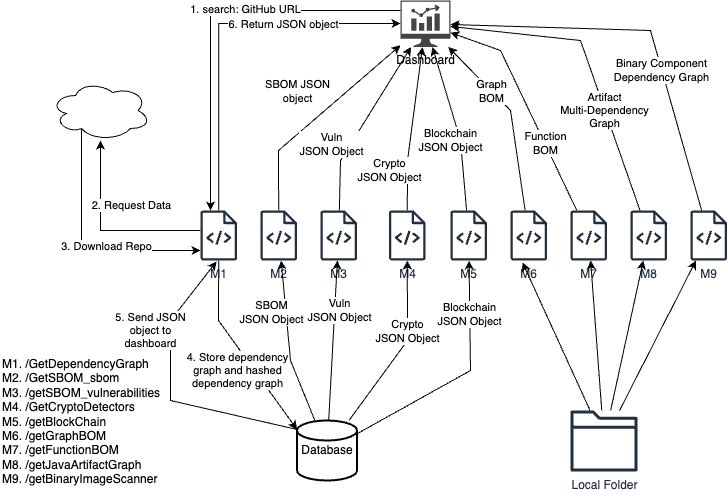

# A platform for the Software Supply Chain Security

GraphBOM: A Platform for the Software Supply Chain Security

## Problem

Current software supply chain platforms do not cater to several important features:

- Dependency trees are not sufficient: dependency graphs may have cycles
  -requires complex system development for graphs
  -requires advanced cryptography (hashing, digital signatures) for graphs
- Package-level dependency is coarse-grained
  -requires dependency at more fine-granular level: function-level
- Not all security metrics are being evaluated
  -requires comprehensive security analysis
- Supply chain is not centralized and at one trust level
  -requires decentralized network of providers

## Introduction

The project demonstrates “**Decentralized and Graph-based Software Supply Chain Security**” that provides various Supply chain security capabilities to enhance to detect the supply chain vulnerabilities across the project with developer sign into blockchain network. To achieve these capabilities, the application primarily depends on the GitHub GraphQL API to construct DAG style dependency graph and WEB3 to build a blockchain network among the developers.

## Features Implemented in the Software Supply Chain Security

1. **Repository Dependency Graph in DAG model**: To build a dependency graph that is a directed graph potentially with cycles (unlike a DAG that does not have a cycle), the application fetches the dependencies of a user specified GitHub repository by using GitHub GraphQL API in the backend. The GitHub keeps verifying the repo dependencies and maintains dependency SBOM. The URL provided by GitHub is https://api.github.com/graphql along with application headers.

2. **SPDX Software Bill of Materials (SBOM)**: Software Package Data Exchange (SPDX) is an open standard for communicating software bill of materials (SBOM) information that supports accurate identification of software components, explicit mapping of relationships between components, and the association of security and licensing information with each component. The DG-SSCS application generates SPDX sbom using syft tool from the repository and necessary fields are extracted from JSON object and integrated to Dashboard UI. SBOM automatically determines which package managers or build systems are being used by the software.

3. **Vulnerability Scanner**: The application scans all the dependencies of a repo and determines the vulnerabilities of every package and provides the package ID, package name, CVE ID, Source URL, Severity and description of each vulnerability. To determine the vulnerabilities, the application uses a grype package from GitHub. Grype supports input of Syft, SPDX, and CycloneDX SBOM formats. If Syft has generated any of these file types, they should have the appropriate information to work properly with Grype. It is also possible to use SBOMs generated by other tools with varying degrees of success. Two things that make Grype matching more successful are inclusion of CPE and Linux distribution information.

4. **Crypto function Detector**: The objective of this module is to determent the all the Cryptographic functions that are utilized in the project and generate predefined JSON structure that includes line number of the Crypto function being used. To accomplish this task, this application used a crypto-detector module developed by Wind River company. Detecting cryptography in the source code of open-source packages or libraries turns out to be a common problem for many of the software companies that include these packages in their products. This module also determines the Quantum-safe or not to every crypto function used in the project.

5. **Java Artifacts Multi-Graph (Directed)**: This module provides the multi-graph dependencies of Java projects dependencies for Java projects. Interdependencies between software modules are very difficult problems to solve. When your organization grows, these interdependencies multiply, potentially leading to low-cohesion and high-coupling among software modules. This is where Jarviz can help to understand these intricate dependencies down to the field level. Jarviz is a dependency analysis tool for Java applications. Since non-private methods in Java classes can be accessed by other classes, method calls can be intertwined creating manifold couplings among each other. Jarviz deeply analyzes Java bytecode to reveal these couplings in a user-friendly format. It scans binary artifacts using a custom classloader and generates a complete graph of dependency couplings between methods across multiple artifacts.

6. **Blockchain integration using WEB3 component**: This module interacts with Ethereum protocol using Web3.py, a powerful API that can interact with blockchain. Ethereum is decentralized blockchain module that allows users to develop blockchain network using web3.py python library using fast API. The DG-SSCS application uses web3.py to sign the developers and their public repos using public key and private keys. Web3.py can help you read block data, sign and send transactions, deploy and interact with contracts, and other features as well.

7. **Container Imagen Scanner (SBOM and Vulnerabilities)**: DG-SSCS application can determine the SPDX SBOM and Vulnerabilities of container images. As of now the, the application supports only Docker container images. This module uses syft and grpye libraries to accomplish this task.

8. **Binary Image/file Analysis**: This module analysis the Linux ELF or binary files and generates dependency graph between functions at assembly level language and determines the exceptions if any like buffer overflow or memory leakage based for different architecture support. angr is a multi-architecture binary analysis toolkit, with the capability to perform dynamic symbolic execution (like Mayhem, KLEE, etc.) and various static analyses on binaries. To generate a dependency graph, the agnr library create multiple in-built modules LIKE Control Flow Graph (CFG), data dependency graph (DDG), and value flow graph (VFG).

## Architecture

The prototype has been designed as a web application. The main logic of the application, written primarily using python, runs behind a Flask server as microservices. Each scanner has been independently implemented and is accessible as its own microservice. The web application is accessible using a dashboard deployed on a React server.

Interactions between the servers and to the back-end microservices are encoded as standardized JSON structures. The React server initiates scans by sending requests to the Flask server and depicts the scan results received from it.



### Microservice Details

1. /GetDependencyGraph : Computes a DAG hash graph from a GitHub repository's dependencies
2. /GetSBOM : Scans for vulnerabilities and SPDX software bill of materials (SBOM) for a repository or container
3. /uploadSign : Allows developer to upload their private key to compute a signature of a generated hash graph for a repository
4. /GetCryptoDetectors : Identify cryptographic components for a repository or a container
5. /GetGraphHash : Computes the hash of a GitHub repository dependencies
6. /GetRepoDetailsForBlockChain : Fetch current blockchain records from Ethereum
7. /getBlockChain : Fetch a specific blockchain, if available in Ethereum
8. /getAllBlockChainHash : Computes hash for all blockchain for a repository, including added, modified, and deleted blockchains
9. /getGraphBOM : Computes GraphBOM for hardware devices and software packages
10. /getFunctionBOM : Identifies the dependency functions outside the project; currently implemented only for Python modules
11. /GetContainerScanner : Scans the Docker containers to identify SBOM details and vulnerabilities associated with dependency packages
12. /getJavaArtifactGraph : Prepares a mutli-dependency graph from the artifacts of a JAVA Maven project
13. /getBinaryImageScanner : Identifies possible memory leakages in a binary image and generates a dependency graph of assembly level segments

## Installation Steps

### Cloning the repository

Before running the dashboard, we need to fetch all the required code to our system. To clone the Git repository to the local system,

```
git clone <GraphBOM github URL>
```

### Prerequisites

The project depends on various tools which are listed in `prerequisites.txt` file. you can use the commands documented in that file and run them individually inside the `GraphBOM` folder.

- [Python](https://www.python.org/downloads/) - If you do not have Python3.9 or higher version, please follow the instructions on Python website to install in your environment.
- [MySQL](https://dev.mysql.com/downloads/mysql/) - If you do not have MySQL, please follow instructions on MySQL website to install in your environment. 
- [NodeJS](https://nodejs.org/en/download) - If you do not have Nodejs and npm, please follow instructions on NodeJS website to install in your environment.
- [Syft](https://github.com/anchore/syft) - Software Bill of Materials. To install Syft, please follow the instructions below:
    * open a new terminal and go to `GraphBOM` folder.
    * Run the syft shell command listed in the prerequisites.txt file. 
- [Grype](https://github.com/anchore/grype) - A vulnerability scanner for container images and filesystems. To install Grype, please follow the instructions below:
    * open a new terminal and go to `GraphBOM` folder.
    * Run the grype shell command listed in the prerequisites.txt file. 
- [crypto-detector](https://github.com/Wind-River/crypto-detector) - Detecting cryptography keywords in the source code of open-source packages or libraries. To install crypto-detector, please follow the instructions below:
    * open a new terminal and go to `GraphBOM` folder.
    * Run the crypto-detector command listed in the prerequisites.txt file. 
 
Note: Inside `lib/.env` set the FILE_PATH variable to the absolute path of the `GraphBOM` folder where syft, grype, and crypto-detectors are downloaded.
```
Example:
Desktop
|--GraphBOM
|  |-- syft
|  |-- grype
|  |-- crypto-detector
|  |-- lib
|      |-- .env

#Inside lib/.env file
#Set the absolute path of the GraphBOM folder where syft, grype, and crypto-detector are downloaded.
FILE_PATH = "/absolute/path/to/GraphBOM"
```

### Database Setup

#### How to set a MySQL PATH in your environment

```
For Mac users,

Run mysql -u root -p command inside the home directory.

If you get `mysql not found`, please follow the following instructions in the home directory:
 - Run `ls -al` to see the `.zshrc` file.
 - If `.zshrc` file exists, then run `open .zshrc`. 
 - If `.zshrc` file not found, then create `.zshrc` file by using the `touch .zshrc`
 - Edit `.zshrc` file
 - At the end of the contents of `.zshrc` file, append the path to mysql binaries.(Example: export PATH=${PATH}:/usr/local/mysql-8.3.0-macos14-arm64/bin). 
 - Save file and close it.
 - Now reload the .zshrc by using `source .zshrc` and then you can use mysql -u root -p to start the service.
```

Make sure to start the MySQL service in your environment before following these steps:

#### Updating GraphBOM/lib/.env file

In the `GraphBOM/lib/.env` file, configure the following MySQL environment variables:

- `ACCESS_TOKEN`: (Required) Specify the GitHub access token for public github repositories. Choose a GitHub fine-grained access token.
- `DB_DATABASE`: (Required) Specify the desired MySQL database name.
- `DB_USER`: (Required) Define the MySQL user for the application.
- `DB_PASSWORD`: (Required) Set the password for the MySQL user.
- `SECRET_KEY`: (Optional) Define the secret key for secure data encryption.
- `RANDOM_KEY`: (Optional) Set a random key for additional security measures.

#### Example: GraphBOM/lib/.env

```
ACCESS_TOKEN = github_fine_grained_token
DB_HOST = localhost
DB_DATABASE = graphbom
DB_USER = testuser
DB_PASSWORD = 12345678
SECRET_KEY =
RANDOM_KEY =
```
#### Executing GraphBOM/db/install_db.sh file

- Change directory to the `GraphBOM/db` folder. 
- Set up the database using `db/install_db.sh` as follows:
- Run `chmod +x install_db.sh` to give execute permission to the file named `install_db.sh`
- Run the script: `./install_db.sh` to create the database. The input to the script should match with corresponding values in the lib/.env file which has   been configured earlier. Ignore the error message "services: command not found" if encountered while executing ./install_db.sh, as it does not impact     the script's functionality.
- After completing the database setup, Move to `GraphBOM/web-app installation` step. 

### Port Configuration

If you are using macOS, please make sure that port 8000 is available for your Flask app.  If you encounter any connection issues between the React and Flask applications, follow these steps:

```
- Check Port Availability: `sudo lsof -i :<portnumber>`
- Disconnect Port: If the port is in use and you need to disconnect it, you can kill the process by using `sudo kill <PID>`
```

### GraphBOM/web-app Installation(Required):

- Open new terminal and go to `GraphBOM/web-app` folder.
- Run the command `npm install`.
- Use `npm install -f` If `npm install` throws an exception due to peer dependencies conflict.
- Run the command `npm start`. 
- The application automatically opens the default browser with the port number. If the port is not available npm will wait until you change the port number.

### GraphBOM/lib Installation(Required):

- Open new terminal and go to `GraphBOM/lib` folder.
- Create a virtual environment using `python3 -m venv envbackend`
- Activate your own virtual python environment using `source envbackend/bin/activate`
- Install all the dependencies from requirements.txt using `pip3 install -r requirements.txt`
- The flask environment by default run in debugging mode. The flask environments exported from .flaskenv file with ports, host, and app.
- After completing of installing `requirement.txt` run the command in the terminal: `python3 -m flask --debug run`.

### GraphBOM/blockchain-api Installation(Optional): [Explore Documentation](./blockchain-api/Readme.md)

- Open another terminal or command line and go to `GraphBOM/blockchain-api` and follow the commands.
- Create a virtual environment using python. Command: `python3 -m venv envweb3`
- Activate your own virtual python environment. Command: `source envweb3/bin/activate`
- Install all the dependencies from requirements.txt. Command: `pip3 install -r requirements.txt`
- Run the web3 client. Command: `python3 -m uvicorn client_fastapiV3:app --reload --port 7000`
- Do not change the port number for web3 client. Keep running it on 7000. If you would like to change, you need to add the port number in .env of backend module as well.

### GraphBOM/binaryimagescanner-app Installation(Optional): [Explore Documentation](./binaryimagescanner-app/README.md)

- NOTE: Use this service, when you are running the GraphBOM app in MacOS only.
- Open another terminal or command line and go to `GraphBOM/binaryimagescanner-app` follow the commands.
- Create a virtual environment using python. Command: `python3 -m venv binaryimage`
- Activate your own virtual python environment. Command: `source binaryimage/bin/activate`
- Install all the dependencies from requirements.txt. Command: `pip3 install -r requirements.txt`
- Run the Command: `python3 -m flask run --port 6000`
- Do not change the port number, let the app run on 6000 only. If you would like to change, you need to update in `GetBinaryImageScanner` route URL in the `GraphBOM/lib` module python app.py.

## Documentation

The documentation is uploaded within the "/docs" directory.

## Contributing

To learn how to contribute to this project, read the [Contribution Guidelines](./CONTRIBUTING.md).

## License

[LICENSE](./LICENSE)
